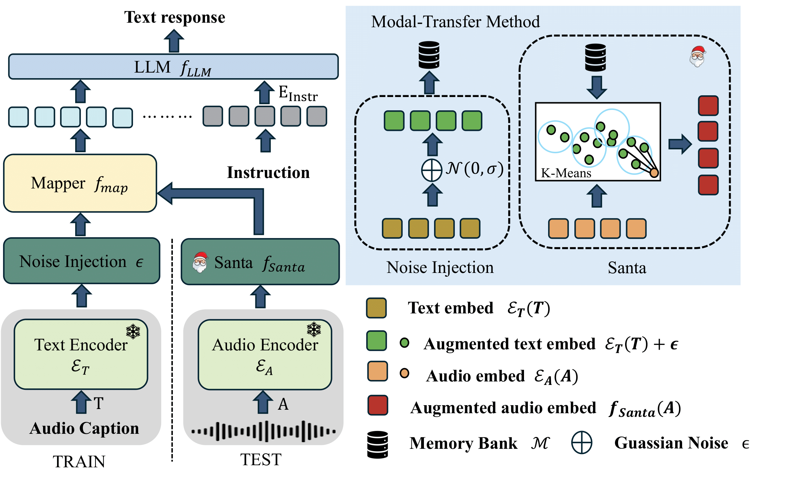

<div align="center">
<div style="display: flex; align-items: center; justify-content: center;">
    <!-- Left: Logo and MATS -->
    <div style="display: flex; align-items: center; margin-right: 20px; text-align: left;">
        
        <h1 style="margin: 0;">[ICML25]MATS: An Audio Language Model under Text-only Supervision</h1>
    </div>
</div>

[Wen Wang](https://github.com/wangwen-banban)<sup>1</sup>, [Ruibing Hou](https://scholar.google.com/citations?user=VfS4cisAAAAJ&hl=zh-CN&oi=ao)<sup>1, :email:</sup>, [Hong Chang](https://scholar.google.com/citations?user=LX6MnNsAAAAJ&hl=zh-CN)<sup>1,2</sup>, [Shiguang Shan](https://scholar.google.com/citations?user=Vkzd7MIAAAAJ&hl=zh-CN)<sup>1,2</sup>, [Xilin Chen](https://scholar.google.com/citations?user=vVx2v20AAAAJ&hl=zh-CN)<sup>1,2</sup>

<sup>1</sup> Key Laboratory of Intelligent Information Processing of Chinese Academy of Sciences (CAS), Institute of Computing Technology, CAS, China <sup>2</sup> University of Chinese Academy of Sciences, China

<sup>:email:</sup> corresponding author, houruibing@ict.ac.cn

[](https://arxiv.org/abs/2502.13433)&nbsp;

[](https://huggingface.co/LBanBan/MAT)&nbsp;

</div>

## News

- **`Feb. 19th, 2025`:** We released our paper on [Arxiv](https://arxiv.org/abs/2502.13433).
- **`May. 1, 2025`:** MATS was accepted by **`ICML2025`**
- We released the weight checkpoint on [Huggingface](https://huggingface.co/LBanBan/MATS).
## Table of Contents

- [News](#news)
- [Table of Contents](#table-of-contents)
- [Abstract](#abstract)
- [Install](#install)
- [Evaluation](#evaluation)
- [Acknowledgement](#acknowledgement)
- [Citation](#citation)

## Abstract

Large audio-language models (LALMs), built upon powerful Large Language Models (LLMs), have exhibited remarkable audio comprehension and reasoning capabilities. However, the training of LALMs demands a large corpus of audio-language pairs, which requires substantial costs in both data collection and training resources. In this paper, we propose **MATS**, an audio-language multimodal LLM designed to handle **M**ultiple **A**udio task using solely **T**ext-only **S**upervision. By leveraging pre-trained audio-language alignment models such as CLAP, we develop a text-only training strategy that projects the shared audio-language latent space into LLM latent space, endowing the LLM with audio comprehension capabilities without relying on audio data during training. To further bridge the modality gap between audio and language embeddings within CLAP, we propose the **S**trongly-rel**a**ted **n**oisy **t**ext with **a**udio (**Santa**) mechanism. Santa maps audio embeddings into CLAP language embedding space while preserving essential information from the audio input. Extensive experiments demonstrate that MATS, despite being trained exclusively on text data, achieves competitive performance compared to recent LALMs trained on large-scale audio-language pairs.

<div align="center">


<b>The architecture of proposed MATS.</b>

<!--  -->

</div>

## Install
```bash
conda create -n mats python==3.9
conda activate mats
pip install -r requirements.txt
```
And you can download the [CLAP](https://huggingface.co/microsoft/msclap) and [LLaMA](https://huggingface.co/lmsys/vicuna-7b-v1.5) checkpoint.
## Evaluation
1. Please modify the datasets in the file `configs/audiofree_config_open.yaml` according to the given example. Note that only the following tasks are supported: `[caption, cla_label, music_caption, QA]`.
   ```yaml
    test_file: "path"
    task: "caption"
    question: None
   ```
   ```yaml
    test_file: "path"
    task: "QA"
    question: "What xxx"
   ```
2. run
   ```bash
   python test.py
   ```

## Acknowledgement
- [SALMONN](https://github.com/bytedance/SALMONN/tree/salmonn): MATS-LLaMA is built upon the SALMONN codebases. 
## Citation

If you find MATS is useful in your research or applications, please consider giving us a star 🌟 and citing it by the following BibTeX entry.

```bibtex
 @article{wang2025matsaudiolanguagemodel,
  title={MATS: An Audio Language Model under Text-only Supervision},
  author={Wen Wang and Ruibing Hou and Hong Chang and Shiguang Shan and Xilin Chen},
  journal={arXiv preprint arXiv:2502.13433},
  year={2025}
}
```
